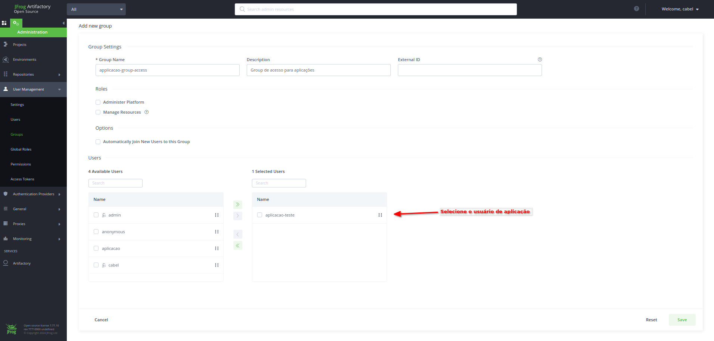

# Jfrog Open Source - Estudo no Microk8s

Estudo para utilizar a ferramenta Jfrog OSS como repositório de dependencias e registry para imagens docker localmente

## Sumário

- [Tecnologias](#tecnologias)
- [Instalação com Microk8s](#instalação-com-microk8s)
- [Acessando o Painel de Controle](#acessando-o-painel-de-controle)
- [Criando Credenciais de Aplicação](#criando-credenciais-de-aplicação)
  - [Criando Usuário e Token de Acesso](#criando-usuário-e-token-de-acesso)
  - [Criando grupo e permissão do usuário de aplicação](#criando-grupo-e-permissão-do-usuário-de-aplicação)
- [Configurando aplicação](#configurando-aplicação)
  - [Maven](#maven)

## Tecnologias

- Kubernetes
- Docker
- Jfrog Open Source (OSS)

## Instalação com Microk8s

Para utilizar o Microk8s, siga os passos abaixo:

1. Certifique-se de ter o Microk8s instalado em sua máquina. Caso não tenha, você pode instalá-lo seguindo as instruções em [https://microk8s.io/docs/](https://microk8s.io/docs/).

2. Aplique os artefatos Kubernetes que estão na pasta K8s utilizando o comando `kubectl apply -f <caminho_do_arquivo>`.

   Por exemplo, se os artefatos estiverem na pasta `/home/somnus/Documentos/git/estudo--jfrog-open-source/K8s`, você pode aplicá-los com o seguinte comando:

   ```
   kubectl apply -f /home/somnus/Documentos/git/estudo--jfrog-open-source/K8s
   ```

3. Aguarde até que todos os artefatos sejam criados e estejam em execução no cluster do Microk8s.

Agora você está pronto para utilizar o Jfrog Open Source com o Microk8s.

## Acessando o Painel de Controle

Para acessar o Painel de Controle do Jfrog Open Source, siga as orientações abaixo:

1. Obtenha a porta em que o Kubernetes Service do Jfrog está associado no localhost. Você pode fazer isso executando o seguinte comando no terminal:

   ```sh
   kubectl get service -n jfrog-oss

   output:

   NAME                  TYPE       CLUSTER-IP       EXTERNAL-IP   PORT(S)                         AGE
   artifactory-service   NodePort   10.152.183.254   <none>        8081:31256/TCP,8082:32018/TCP   3h18m
   ```

2. Após obter a porta do host que está associada a 8082 do pod, acesse a seguinte URL no seu navegador:

   ```
   http://localhost:<porta>/ui
   ```

   Substitua `<porta>` pela porta obtida no passo anterior.

3. Na página de login, utilize as seguintes credenciais:
   - Username: admin
   - Password: password


Agora você poderá acessar e utilizar o Painel de Controle do Jfrog Open
Source.

## Criando Credenciais de Aplicação

Para utilizar o Artifactory nas aplicações, foi utilizada uma credencial nova com permissões minimas para que seja nos projetos, a seguir será detalhado o procedimento para criação dessa credencial.

### Criando Usuário e Token de Acesso

Primeiro, será criado o usuário de aplicação, e configurado para que utilize Bearer Token ao acessar o Artifactory. Siga os passos a seguir:

1. Na tela principal, selecione a opção _User Management>Users_:

   

2. Clique no botão "New User" para criar um novo usuário.

   

3. Preencha as informações do usuário, assinando as opções conforme a image.

   

4. Com o usuário criado, volte a tela principal e acesse a opção _User Management>Acces Token_.

   

5. Na seção "Access Tokens", clique em "New Token" para gerar um novo token de acesso.

   

6. Selecione conforme a imagem, selecionando o usuário criado na etapa **3**.

   

7. Copie o token gerado e guarde-o em um local seguro. Esse token será utilizado como Bearer Token para acessar o Artifactory.

   

Agora você criou um novo usuário e gerou um token de acesso para utilizá-lo como Bearer Token no Artifactory.

### Criando grupo e permissão do usuário de aplicação

Com o usuário criado, será feita a atribuição de acesso através de um grupo que será associado ao usuário. Siga os passos abaixo:

1. Na tela principal do Jfrog, selecione a opção _User Management>Groups_:

   

2. Clique no botão "New Group" para criar um novo grupo.

   

3. Preencha as informações do grupo, atribuindo um nome e selecionando o usuário de aplicação.

   

4. Com o grupo criado, volte à tela principal e acesse a opção _User Management>Permissions_.

   

5. Na tela de permissões, selecione a opção _New Permission_.

   

6. No Formulário, defina um nome e depois selecione a opção _Add Repositories_.

   

7. Selecione as opções conforme a imagem para que tenha acesso a todos os repositórios virtuais e locais.

   

8. Com os repositórios adicionados, agora selecione a opção de grupos e pesquise pelo nome do grupo que foi criado na etapa **3**.

   

Pronto, agora voce possui um usuário de aplicação, que tem o seu acesso controlado por um acesso de grupo, caso seja necessário criar outras Usuarios com o mesmo acesso, basta inclui-los no mesmo grupo.

## Configurando aplicação

Agora é a etapa de configurar a aplicação para que utilize as credenciais, se autenticando no Artifactory e baixando suas dependencias

### Maven

Para aplicações que utilizam o maven, deve se ajustar dois arquivos, o arquivo `settings.xml` do host e `pom.xml` do projeto. Abaixo está os ajustes:

### pom.xml

```xml
<project xmlns="http://maven.apache.org/POM/4.0.0" xmlns:xsi="http://www.w3.org/2001/XMLSchema-instance" xsi:schemaLocation="http://maven.apache.org/POM/4.0.0 https://maven.apache.org/xsd/maven-4.0.0.xsd">

    <!-- omitindo informações do projeto -->

    <!-- adicione a configuração abaixo, seguindo o mesmo id configurado no arquivo settings.xml -->
    <repositories>
        <repository>
            <id>artifactory-repo</id>
            <url>http://localhost:31256/artifactory/maven-dev-virtual/</url>
        </repository>
    </repositories>

    <!-- omitindo dependencias -->

</project>
```

### settings.xml

```xml
<settings>

    <!-- força projetos maven a utilizarem somente o repositório definido -->

  <mirrors>
    <mirror>
      <id>artifactory-repo</id>
      <name>Maven Repository Manager running on artifactory localhost</name>
      <url>http://localhost:31256/artifactory/maven-dev-virtual/</url>
      <mirrorOf>*</mirrorOf>
    </mirror>
  </mirrors>

    <!-- confiuração de autenticação do Artifactory com Bearer Token -->
  <servers>
    <server>
      <id>artifactory-repo</id>
      <configuration>
        <httpHeaders>
          <property>
            <name>Authorization</name>
            <value>Bearer ${TOKEN_JWT_ARTIFACTORY}</value>
          </property>
        </httpHeaders>
      </configuration>
    </server>
  </servers>
</settings>


```
